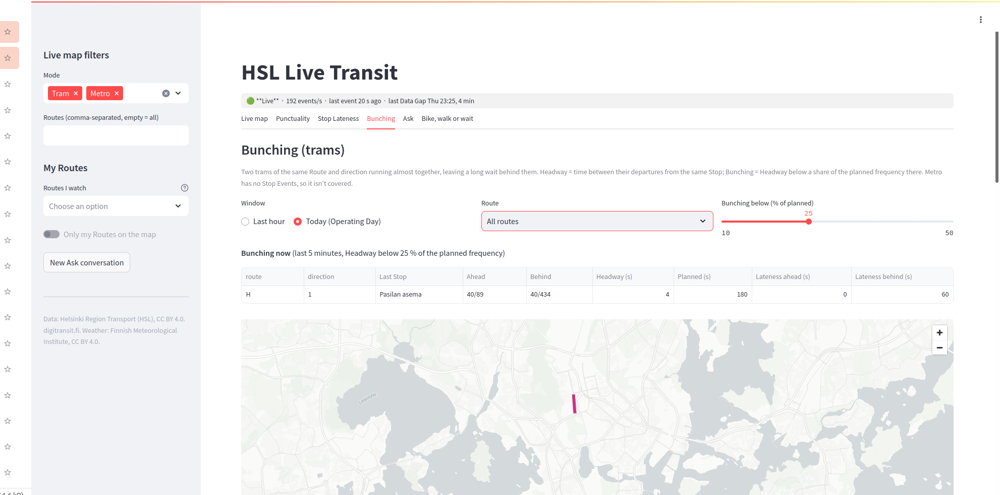

# Should I wait for the tram? Adding agents to a live Helsinki transit app on Databricks

*DRAFT for review (part 2, story version).*

In [part 1](https://medium.com/@sumesh.kashyap90/following-helsinkis-trams-in-real-time-a-databricks-build-story-637ac9fa9ac6) I built a Databricks App that follows every tram and metro train in Helsinki in real time: a live map, a punctuality board, a chat box that answers "Is tram 4 on time right now?", and a way for riders to report problems.

Then I stood at a tram stop again. The app told me tram 3 was running late, and that was all it did. What I actually wanted to know was the next question: *so what should I do?* There's a city bike station across the street. Is it faster to grab a bike? Is it going to rain? Is it too windy to cycle along the seafront? And when the tram finally comes, is there another one right behind it, half empty?

That's a job for an agent: something that looks at several sources, combines them and gives one answer. This post is about building two of them on top of the app from part 1:

- **Bike, walk or wait** compares the next tram with walking and a city bike, checks the weather, and tells you what to do.
- **Bunching spotter** finds trams of the same route running almost together, which leaves a long gap behind them.


*From Alppila to Erottaja: wait. Tram 3 gets there in 28 minutes, walking takes 46, and a city bike would take 26, but gusts up to 11 m/s are forecast. Below the advice is the lateness our own pipeline measured for that very tram: two minutes early.*

As before, I'll stop at each new Databricks piece, explain it in a few lines, and leave a link to the docs. The code is in the same repository: [SumeshKashyap/Helisinskis_trams_using_Databricks_apps_lakebase](https://github.com/SumeshKashyap/Helisinskis_trams_using_Databricks_apps_lakebase).

## Chapter 1: What the model is not allowed to decide

Before writing any code, I made one rule: **the language model doesn't make the decision.**

"Should I bike?" has a right answer once you know the numbers, and I want that answer to be the same every time, explainable, and covered by unit tests. So the decision is a plain Python function with a handful of thresholds:

```python
RAIN_MM_H = 0.5            # forecast rain that rules out the bike
RAIN_PROBABILITY_PCT = 70  # ... or this chance of rain
GUST_MS = 10.0             # gusts that rule out the bike
WALK_IN_RAIN_MAX_S = 600   # in rain, walk only if it takes at most 10 min
BIKE_MIN_SAVING_S = 120    # the bike must beat the tram by 2 min to be worth the hassle
```

Walking wins if it gets you there no later than the tram. The bike wins if it saves at least two minutes and the weather allows it. Otherwise you wait. Outside the city bike season (April to October in Helsinki), the bike simply isn't an option. Fourteen unit tests pin these rules down.

The model gets everything else: understanding the question, picking the right tools, and explaining the result in a few friendly lines. That split turned out to be the most important decision of the whole build, and I'll come back to it.

## Chapter 2: Tools that live in Unity Catalog

An agent is only as good as its tools. My agent needed five:

| Tool | What it does | Where the data comes from |
|---|---|---|
| `find_stop` | Finds a stop by name | Our GTFS table |
| `tram_lateness` | Current lateness of each tram on a route | Our live pipeline |
| `weather_outlook` | Rain, chance of rain, wind, gusts, temperature for the next hours | Finnish Meteorological Institute |
| `trip_options` | Leaving now: tram, walk or city bike, with arrival times and bike availability | HSL's journey planner (Digitransit) |
| `bike_walk_or_wait` | Runs all of the above for two stops and applies the rule | All of them |

I could have written these as Python functions inside the app. Instead I put every one of them in **Unity Catalog as a function**. That way they're governed like tables (who may run them is a `GRANT`), anyone can call them from SQL, a notebook or Genie, and they're not locked inside my Streamlit code.

**Unity Catalog functions in a nutshell.** A function in Unity Catalog is a named piece of logic, `catalog.schema.function`, written in SQL or Python. Scalar functions return one value; table functions (`RETURNS TABLE (...)`) return rows and are queried like a table: `SELECT * FROM find_stop('Kaivopuisto')`. They have owners and permissions (`GRANT EXECUTE`), and their comments double as documentation, for people and for AI tools.

Docs: [UC functions](https://docs.databricks.com/aws/en/udf/unity-catalog) · [CREATE FUNCTION (SQL and Python)](https://docs.databricks.com/aws/en/sql/language-manual/sql-ref-syntax-ddl-create-sql-function)

Then came the first surprise. My weather tool needs to call FMI's API over the internet, and **Python functions in Unity Catalog run in a sandbox with no network access**. The way out is a SQL function that calls `http_request` through a Unity Catalog **HTTP connection**:

```sql
CREATE CONNECTION hsl_fmi TYPE HTTP
OPTIONS (host 'https://opendata.fmi.fi', port '443', base_path '/', bearer_token 'unused');

CREATE OR REPLACE FUNCTION weather_outlook(lat DOUBLE, lon DOUBLE)
RETURNS TABLE (forecast_at TIMESTAMP, precipitation_mm_h DOUBLE, gust_ms DOUBLE, ...)
RETURN
  WITH r AS (
    SELECT http_request(
      conn => 'hsl_fmi', method => 'GET', path => 'wfs',
      params => map('storedquery_id', 'fmi::forecast::edited::weather::scandinavia::point::simple',
                    'latlon', format_string('%.5f,%.5f', lat, lon),
                    'parameters', 'Precipitation1h,PoP,WindSpeedMS,HourlyMaximumGust,Temperature', ...)
    ).text AS x
  )
  SELECT ... -- parse the XML with xpath()
```

The journey planner needs an API key. That key sits in a Databricks secret scope, and the function reads it with `secret()`. Callers can use the key through the function, but they can never read it.

**HTTP connections in a nutshell.** A Unity Catalog connection stores how to reach an outside service (host, base path, credentials) as a governed object. `http_request(conn => ..., method => ..., path => ..., params => ..., json => ...)` calls it from SQL and returns the status code and body. Who may use it is again a grant: `GRANT USE CONNECTION`. Databricks now marks `http_request` as deprecated in favour of a proxy endpoint, but that endpoint can't be called from inside a function, so for tools that live in Unity Catalog, `http_request` is still the way.

Docs: [HTTP connections](https://docs.databricks.com/aws/en/query-federation/http) · [`http_request`](https://docs.databricks.com/aws/en/sql/language-manual/functions/http_request) · [`secret`](https://docs.databricks.com/aws/en/sql/language-manual/functions/secret) · [Secrets](https://docs.databricks.com/aws/en/security/secrets/)

And the decision rule from chapter 1? It doesn't need the network, so it became a **Python function** in Unity Catalog. My setup script pastes the exact same `rules.py` file that the unit tests run into the function body. One source, tested locally, running in the catalog.

## Chapter 3: A hundred lines of agent

An agent, under all the frameworks, is a short loop:

1. Send the model the conversation and a list of tools it may use.
2. If it asks for a tool, run it and send back the result.
3. Repeat until it answers in plain text.

So the app runs that loop itself, on `databricks-gpt-oss-120b`:

```python
for _ in range(MAX_STEPS):
    msg = invoke(messages, TOOLS)            # Foundation Model API, tool calling
    calls = msg.get("tool_calls") or []
    if not calls:
        return msg["content"]                # the answer
    messages.append({"role": "assistant", "content": None, "tool_calls": calls})
    for c in calls:
        result = run_tool(c["function"]["name"], json.loads(c["function"]["arguments"]))
        messages.append({"role": "tool", "tool_call_id": c["id"], "content": json.dumps(result)})
```

`run_tool` runs the Unity Catalog function on the SQL warehouse, as a parameterised query:

```python
SQL = {
    "bike_walk_or_wait": "SELECT * FROM {p}.bike_walk_or_wait(:from_stop, :to_stop)",
    "tram_lateness":     "SELECT * FROM {p}.tram_lateness(:route)",
    ...
}
```

The model never writes SQL. It can only pick one of the declared tools, only the declared arguments reach the query, and those go in as parameters. The worst it can do is ask a silly question of a function it's allowed to call anyway. History questions ("which route was most late today?") are routed to the Genie space from part 1, as one more tool.

**Foundation Model APIs in a nutshell.** Databricks serves popular open and partner models behind ready-made endpoints, paid per token, with an OpenAI-compatible chat format, including **tool calling**: you describe your functions as JSON schemas, and the model replies with the call it wants to make instead of text. In a Databricks App you attach the endpoint as a resource with `CAN_QUERY`, and the app's service principal calls `/serving-endpoints/<name>/invocations`. No keys, no extra packages.

Docs: [Foundation Model APIs](https://docs.databricks.com/aws/en/machine-learning/foundation-model-apis/) · [Function calling](https://docs.databricks.com/aws/en/machine-learning/model-serving/function-calling) · [App resources](https://docs.databricks.com/aws/en/dev-tools/databricks-apps/resources)

The model is a bundle variable. Switching to another model, such as Claude, is a one-line change, and because the decision lives in the rule, a different model changes the wording but not the advice.

## Chapter 4: Where our own pipeline earns its keep

The journey planner already knows HSL's real-time estimate for the next tram. So what does my pipeline from part 1 add?

It adds a second opinion, measured by us. The planner returns the route, direction, service date and start time of the tram it suggests. That's exactly how my pipeline builds its journey id (`route|direction|operating day|start time`). So `bike_walk_or_wait` joins the planner's tram to the lateness we measured from its own position reports a few seconds ago. In the screenshot at the top, that's the line *"Our measured Lateness for this tram: -119 s (seen 45 s ago)"*.

When the pipeline isn't running, the answer says so: our measured lateness is *unknown right now*. It never says the tram is on time just because we have no data. That rule from part 1 carried over unchanged.

The app shows the advice in two ways:

- **A form** with two stop pickers. It calls `bike_walk_or_wait` directly and needs no model at all, so it's fast and always gives the same answer.
- **An agent chat** for everything else, such as "Will it rain at Hakaniemi in the next hour?" or "Is tram 4 late?", with a "Tools the agent used" section that shows every call and its result.

## Chapter 5: Bunching, or why two trams arrive at once

You've seen it: you wait twelve minutes, then two trams of the same route arrive together. The first is packed, the second nearly empty. Transit people call this **bunching**. A tram that falls behind picks up more waiting passengers, which slows it down further, while the one behind catches up.

My pipeline already records every departure from every stop. So **headway**, the time between two trams of the same route leaving the same stop, is a window function away:

```sql
lag(departed_at) OVER (PARTITION BY route, direction, stop_id ORDER BY departed_at)
```

A pair is **bunching** when its headway is under 25 % of the planned frequency. Defining "planned frequency" took two attempts.

**Attempt one** compared the pair with the timetable gap between those same two journeys. Real data broke it right away. Some trams in the feed are logged as *two hours* late, which made the "planned" gap two hours long, so a normal gap looked like bunching. **Attempt two** uses the usual scheduled gap at that stop in that hour, the median of all of them. That made a tram that's hours late irrelevant. One more fix: my demo runs are short, so a departure's "previous scheduled departure" can be days earlier. Gaps over an hour are ignored. Pairs without a sensible baseline get no verdict rather than a wrong one.

On the history I had collected, about 1 % of departures were bunched. Route 4 had the textbook case: the front tram 8 minutes late, the one behind it 2.5 minutes *early*, leaving Kauppiaankatu 95 seconds apart.

And then, while I was testing, it happened live. Two route H trams ran together for three stops: 34 seconds apart at Ooppera, 5 at Töölön halli and 52 at Kansaneläkelaitos, where the plan says 5 to 6 minutes. A little later route H did it again, and this time I had the map open:


*Bunching now: two route H trams left Pasilan asema 4 seconds apart, where the plan says 3 minutes. The short pink line on the map joins the two trams.*

The first of those pairs gave me a lesson in counting. My first table said "3 bunching" next to "36 pairs", and even I had to look twice. It was counting *departures*, not *pairs of trams*: one pair passing three stops counted three times. The table now shows both: 3 bunched departures, 1 tram pair.

The agent got a `bunching_now` tool too. When its advice is "wait", it checks the route and can add: "another tram left the last stop only 34 seconds behind this one". It never says the second tram is emptier, because HSL doesn't publish tram occupancy, and I don't want the agent making things up.

## Chapter 6: When an empty answer lies

One test answer stopped me. I asked the agent "Are trams bunching on route 4 right now?" while my pipeline was switched off. The tool returned no rows, and the model said, confidently: *"No, trams are not bunching on route 4."*

The instructions told it, in so many words, that no rows with the feed off means *unknown*. It even called the lateness tool to check whether the feed was live, then ignored what it found.

I didn't try to fix this with a better prompt. I fixed the tool: `bunching_now` now always returns at least one row with `feed_live` true or false. "No data" and "no bunching" are now different answers in the data itself, not a distinction the model has to remember. The same idea runs through the whole build: put the facts and the decisions in the tools, and let the model do the talking.

## What I'd tell a friend adding agents to a data app

- **Let rules decide and the model explain.** Anything with a right answer belongs in code with tests. Then a weaker or different model can change the wording, but not the advice.
- **Put tools in Unity Catalog.** They get permissions, comments and SQL access for free, and any agent framework can use them later.
- **Make tools honest about what they don't know.** Return "unknown" as data. Don't expect the model to infer it from an empty result.
- **Look at the data before you trust a definition.** Two-hour-late trams and short demo runs broke my first definition of bunching within minutes.

Next time two trams arrive at your stop together, let the first one go.

## Credits

Vehicle positions, timetables, the journey planner and city bike data: [Helsinki Region Transport (HSL)](https://www.hsl.fi/en/hsl/open-data) via [Digitransit](https://digitransit.fi/en/developers/apis/1-routing-api/), licensed CC BY 4.0. Weather forecasts: [Finnish Meteorological Institute open data](https://en.ilmatieteenlaitos.fi/open-data), licensed CC BY 4.0.

---

*Review notes (remove before publishing):*
- *Numbers are from 2026-10-08: the Alppila → Erottaja advice is from your screenshot; the route H pair (34 / 5 / 52 s at Ooppera / Töölön halli / Kansaneläkelaitos) and route 4 at Kauppiaankatu (95 s; leader +480 s, follower −155 s) are from the live feed and history that day; "about 1 %" is 45 of 4,164 departures.*
- *The cause of the Supervisor Agent / Claude block isn't confirmed; the text says "as far as I can tell". Update it if you find out (Partner-powered AI features, or sales).*
- *`bunching_app.png` predates the table relabel and the health-strip fix (it shows `**Live**` and lowercase headers). Retake it during the next demo session if you want it clean. `bunching.png` is no longer in the folder, so the post uses only `bunching_app.png`.*
- *"A hundred lines": `src/app/agent.py` has about 120 non-blank code lines without the prompt and the tool descriptions (215 lines in all).*
- *Doc links point to the AWS docs; each page has a cloud selector for Azure and GCP.*
