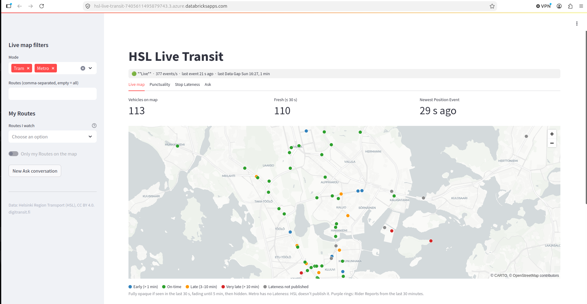
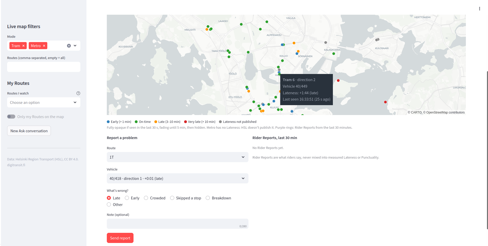
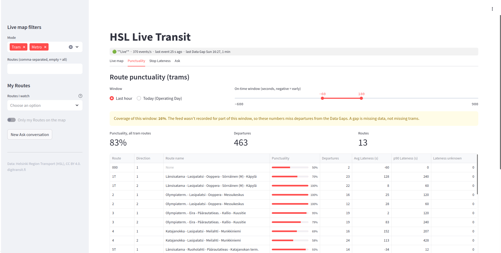
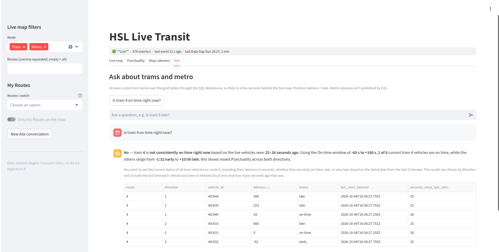
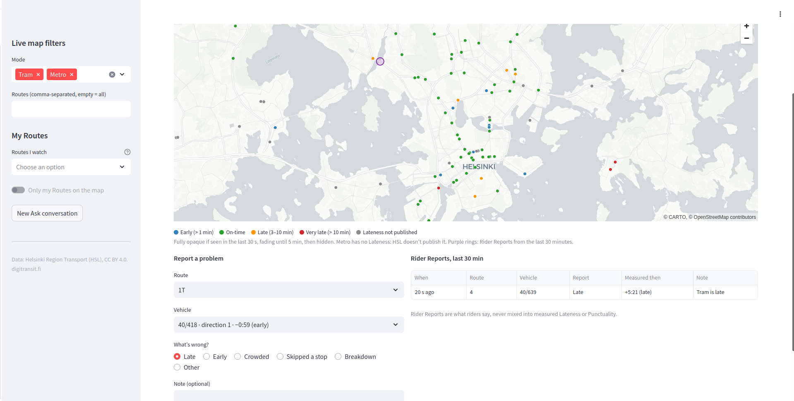

# Following Helsinki's trams in real time: a Databricks build story

*DRAFT for review (story version).*

Picture a tram stop in Helsinki on a cold evening. You're looking down the street, wondering whether tram 4 is two minutes away or twelve. Somewhere in that tram, a small computer already knows. About four times a second, it announces where the tram is and how far it is from its timetable. What if the official Helsinki transport shows tram is on time but it actually is delayed and I as a user want to report it? Would it be nice to see analytics of late trams on route which I am supposed to take for the airport next morning? 

Helsinki Region Transport (HSL) publishes all of those announcements on an open feed that anyone can listen to.
When I found that feed, one question stuck with me: how much of a real, live app could I build on it using nothing but Databricks? No Kafka cluster on the side, no extra servers, nothing you couldn't deploy yourself from one repository.

This is the story of that build. It ended up as a Databricks App with a live map of every tram and metro train, a punctuality board, a chat box that answers "Is tram 4 on time right now?", and a way for riders to report problems that flows back into the lakehouse. Along the way I'll stop at each Databricks component, explain in a few lines what it is, and leave you a link to the official docs so you can explore further.


*Where we end up: the live map. The strip at the top says the feed is live at 377 events per second. The grey dots are metro trains, which don't publish lateness.*

If you'd rather read code than prose, it's all on GitHub: [SumeshKashyap/Helisinskis_trams_using_Databricks_apps_lakebase](https://github.com/SumeshKashyap/Helisinskis_trams_using_Databricks_apps_lakebase).

## The map before the journey

Here's the whole thing on one page, so you know where we're heading:


*The whole build on one page. Data enters on the left, riders sit on the right, and the bottom row is the road back into the lakehouse. Everything inside the Databricks box is deployed by one bundle.*

Data flows in from the left and gets cleaned up in a pipeline. Then it leaves by three different doors, because three parts of the app want very different things:

- The **live map** asks "where is everything *right now*?" every few seconds. That needs millisecond answers, so it reads from **Lakebase**.
- The **analytics tabs** ask "how punctual was route 4 today?". That's a big aggregation over lots of rows, which is a job for a **serverless SQL warehouse**.
- **Rider reports** are people *writing* data, and that wants a real transactional database. So it's **Lakebase again**, this time as plain Postgres.

All of it lives in a single bundle, so one command deploys the pipeline, jobs, database, warehouse, Genie space, dashboard and app together.

**Bundles in a nutshell.** A bundle (Databricks Asset Bundles, now called Declarative Automation Bundles) is a `databricks.yml` file plus some YAML under `resources/` that describes your workspace resources as code. `databricks bundle deploy -t dev` creates or updates everything, and `bundle run` starts a job, pipeline or app. Targets like `dev` and `prod` swap catalogs, schemas and permissions without copying files. The bundle also builds your Python code into a wheel and attaches it to the pipeline. Remember that; it saves the day a bit later.

Docs: [What are bundles?](https://docs.databricks.com/aws/en/dev-tools/bundles/) · [Bundle resources](https://docs.databricks.com/aws/en/dev-tools/bundles/resources)

## Chapter 1: Listening to the trams

The first problem showed up right away. HSL's High-Frequency Positioning (HFP) feed speaks MQTT, not Kafka. The usual fix is a little bridge service that forwards MQTT messages into Kafka or Event Hubs. That works, but it's one more thing for you to run, watch and pay for. I wanted to avoid it.

So I taught Spark to speak MQTT itself, with a **custom PySpark Python Data Source**:

```python
class HslMqttDataSource(DataSource):
    @classmethod
    def name(cls):
        return "hsl_mqtt"

    def simpleStreamReader(self, schema):
        return _HslMqttReader(self.options)
```

The reader keeps one MQTT connection open on the driver, collects messages between micro-batches, and hands them to Spark as rows. From the pipeline's point of view, it's just another stream:

```python
spark.readStream.format("hsl_mqtt").option("topics", topics).load()
```

**Python Data Sources in a nutshell.** Since Spark 4.0 (and on current Databricks runtimes and serverless), you can write your own data source in pure Python. You subclass `DataSource` and return a reader. A streaming reader also keeps track of offsets, so Structured Streaming knows what it has already seen. `simpleStreamReader` is the easiest kind: it runs on the driver and returns each micro-batch directly, which is perfect for a modest push feed like this one. Register it with `spark.dataSource.register(...)` and it works with `spark.read` and `spark.readStream`, including inside a Lakeflow pipeline.

Docs: [PySpark custom data sources](https://docs.databricks.com/aws/en/pyspark/datasources)

MQTT has one catch: it doesn't keep history. If my stream is down for five minutes, those five minutes are simply gone. I didn't want the app to quietly pretend nothing happened during those minutes. So the reader sends a small **heartbeat** row every 10 seconds, even when no tram moves, and every restart gets a fresh session id. Later on, a missing heartbeat becomes a **Data Gap**. The app can then say "we weren't listening", which is very different from "no trams ran".

The first day didn't go smoothly, though. Two surprises ate most of it, and if you ever write your own data source, I hope these save you that day:

1. **paho-mqtt froze without a word.** Inside, the paho library opens a tiny TCP connection to itself on 127.0.0.1 as a wake-up signal. On Standard access mode clusters and on serverless, that connection is never accepted, so `loop_start()` just hangs forever. No error, no timeout, nothing. The fix was to hand paho a Unix socket pair instead:

    ```python
    def _unix_socketpair():
        a, b = socket.socketpair()
        a.setblocking(False)
        b.setblocking(False)
        return a, b

    mqtt._socketpair_compat = _unix_socketpair  # inside the connect function, not at import
    ```

2. **The data source couldn't find its own code.** The reader runs in a separate worker process, and that process can't import files from your workspace, so you get `ModuleNotFoundError`. This is where the bundle's wheel comes to the rescue: ship the module as a wheel attached to the pipeline (or register it by value with `cloudpickle`). One more trap: module-level code, like the patch above, doesn't run in the worker. Do your patching inside functions.

## Chapter 2: Getting to know the data

Before building anything else, I recorded ten minutes of the feed on a Saturday evening and just looked at it. I'm glad I did, because the data had some surprises of its own.

The docs suggest about one message per tram per second. I saw 326 tram position messages per second from only 81 trams, about four each. Looking closer, **every position arrived four times, byte for byte identical**. So the silver layer removes duplicates by vehicle, event type and timestamp, within a two-minute window.

Two more discoveries changed the design:

- **The metro shares its position, but not its lateness.** Every metro lateness value (`dl`) is empty, and metro sends no stop events. Instead of guessing, the metro stays on the map in a calm grey labelled "lateness not published", and it's left out of punctuality figures.
- **HSL's `dl` is negative when a tram is late.** That's backwards from what most of us would expect. So the pipeline flips it exactly once, in silver: `lateness_s = -dl`, and positive now means late. Nothing after bronze ever sees the confusing original.

I also compared HSL's own lateness on stop events with the public timetable. They agree closely (r = 0.99), but HSL's number is about 22 seconds less late. My guess is that HSL uses a more precise internal schedule than the whole minutes in the public timetable. Twenty-two seconds is enough to push a departure from "on time" to "late", so I kept both numbers side by side.

## Chapter 3: Raw data in, trustworthy tables out

With the data understood, it was time to shape it. The pipeline is a Lakeflow Declarative Pipeline running in continuous mode.

**Lakeflow pipelines in a nutshell.** This is what used to be called Delta Live Tables. Instead of writing *how* to move data step by step, you declare *what* each table should be, as a Python function or a SQL query. The pipeline works out the order, creates the tables, handles checkpoints and retries, and runs on serverless compute. Four ideas cover everything in this project:

- **Streaming tables** process each new row once, as it arrives. Bronze and silver are streaming tables.
- **Materialized views** are kept up to date from their sources, incrementally where possible. Coverage and ingestion sessions are materialized views.
- **Expectations** are data-quality rules: log a bad row, drop it, or stop the update. You can see the results in the pipeline UI.
- **AUTO CDC** (formerly `APPLY CHANGES`) turns a stream of changes into a table with one current row per key (SCD type 1) or a full history (SCD type 2), even when events arrive out of order.

In *continuous* mode the pipeline keeps running and processes small batches as data arrives. In *triggered* mode it processes what's there and stops.

Docs: [Lakeflow pipelines](https://docs.databricks.com/aws/en/ldp/) · [Concepts](https://docs.databricks.com/aws/en/ldp/concepts) · [Streaming tables](https://docs.databricks.com/aws/en/ldp/concepts/streaming-tables) · [Materialized views](https://docs.databricks.com/aws/en/ldp/concepts/materialized-views) · [Expectations](https://docs.databricks.com/aws/en/ldp/expectations) · [AUTO CDC](https://docs.databricks.com/aws/en/ldp/cdc) · [Delta change data feed](https://docs.databricks.com/aws/en/tables/features/change-data-feed)

Here's how the layers turned out:

- **Bronze** keeps the raw message exactly as it came in, plus when we received it and which session it belongs to. It's append-only and kept for 5 days.
- **Silver** turns messages into typed Position Events and Stop Events and removes duplicates. Expectations drop positions outside the Helsinki region, and flag (but keep) lateness beyond ±1 hour. Heartbeats and ingestion sessions live here too.
- **Gold** has the tables the app actually uses:
  - `gold_vehicle_current`: the latest position of every vehicle, kept current with AUTO CDC and with Change Data Feed switched on for Lakebase;
  - `gold_departures`: one row per tram departure, joined to stop and route names from HSL's daily GTFS timetable (99 % of departures find their stop);
  - `gold_coverage_minutely`: for every minute, how many seconds we were actually listening.

That last table is my favourite, because it keeps the app honest. Every number the app shows comes with its **Coverage**: how much of the time window we really recorded. Start the pipeline at 14:00, ask for "today", and you'll get the punctuality figure *and* a friendly warning that it only covers part of the day.

## Chapter 4: Putting trams on the map

Now for the fun part: dots moving across Helsinki.

The live map refreshes every 4 seconds for every open browser. If that went to a SQL warehouse, each viewer would fire a query every few seconds and the warehouse would never get to sleep. So `gold_vehicle_current` is copied into **Lakebase**, Databricks' serverless Postgres, as a continuously synced table.

**Lakebase in a nutshell.** Lakebase is managed PostgreSQL that lives inside Databricks. It's built for the quick, small reads and writes apps make: look up one row, insert one row, many users at once. Four features mattered here:

- **Storage and compute are separate.** Compute scales up and down, and can *scale to zero* when nobody's using it, waking up on the next connection.
- **Branches** work like git branches for your database: a full copy in seconds that you can test on and throw away.
- **Synced tables** copy a Delta table from Unity Catalog into a read-only Postgres table, as a *snapshot*, on a *trigger* or *continuously*. Continuous sync reads the source table's change data feed, which is why `gold_vehicle_current` has it switched on.
- **It's part of Unity Catalog.** You sign in with your Databricks identity and short-lived tokens, not stored passwords.

Docs: [Lakebase Postgres](https://docs.databricks.com/aws/en/oltp/projects) · [Synced tables](https://docs.databricks.com/aws/en/oltp/projects/sync-tables) · [Autoscaling](https://docs.databricks.com/aws/en/oltp/projects/autoscaling) · [Scale to zero](https://docs.databricks.com/aws/en/oltp/projects/scale-to-zero) · [Branches](https://docs.databricks.com/aws/en/oltp/projects/branches)

Setting up the sync took just a few lines in the bundle:

```yaml
postgres_synced_tables:
  gold_vehicle_current_online:
    source_table_full_name: ${var.catalog}.${var.schema}.gold_vehicle_current
    primary_key_columns: [vehicle_id]
    scheduling_policy: CONTINUOUS
```

The result is fast: the map's query takes **about 20 ms** (24 ms at p95). The app is built with Streamlit and pydeck. Each tram is coloured by how late it is, and it slowly fades as its last known position gets older: fully solid for 30 seconds, gone after 5 minutes. My favourite moment is stopping the pipeline and watching the whole city slowly turn transparent.


*Hover over a tram to meet it: tram 6, direction 2, 1 minute 44 seconds late, last seen 25 seconds ago. The "Report a problem" form waits under the map.*

How fresh is a dot? From the moment HSL timestamps a position to the moment it appears on the map takes about **26 seconds at p95**. Nearly all of that is the four streaming hops, each running small batches every few seconds: bronze about 4.5 s, silver 9–12 s, gold about 25 s. The Lakebase sync and the map query barely register. For a demo, that's plenty. To get under 15 seconds, I'd skip the silver hop for current positions, or try [Real-Time Mode](https://docs.databricks.com/aws/en/structured-streaming/real-time/), a Structured Streaming trigger built for sub-second latency.

## Chapter 5: Asking how punctual the trams really are

A live map is fun, but the bigger questions are about patterns. Which routes run late? Which stops are trouble? Those tabs read the gold tables through a 2X-Small serverless SQL warehouse.

**SQL warehouses in a nutshell.** A SQL warehouse is compute dedicated to running SQL, powered by the Photon engine. The *serverless* kind starts in seconds, adds capacity when more people query at once, and switches itself off when idle, which suits an app that's only open during demos. The app connects with `databricks-sql-connector`, signed in as the app's own service principal.

Docs: [SQL warehouses](https://docs.databricks.com/aws/en/compute/sql-warehouse/) · [Serverless SQL warehouses](https://docs.databricks.com/aws/en/admin/sql/serverless)

Here's what you'll find in those tabs:

- **Punctuality** per route and direction, for the last hour or the whole operating day. A slider lets you decide what "on time" means (by default, from 60 seconds early to 3 minutes late). It's calculated when you ask, from `gold_departures`, because everyone's idea of "on time" is a little different.
- **Stop lateness**: a map of tram stops coloured by how late departures are on average.
- **A health strip** that tells you whether the feed is live, how many events per second are arriving, when the last one came in, and when the last Data Gap was.

Every query comes back in 0.5–2.6 seconds. The departures chart shades Data Gaps in grey, so a flat line during an outage clearly reads as "we weren't listening", not "no trams ran".


*The last hour: 83 % of 463 departures were on time. The yellow note is the coverage table at work: the feed only covered 16 % of this hour.*

The same data also powers an **AI/BI dashboard**, built without writing any app code. Its datasets are SQL queries, its charts are drag-and-drop, and the on-time window is a dashboard parameter.

**AI/BI dashboards in a nutshell.** These used to be called Lakeview dashboards. You write SQL datasets, drag widgets onto a canvas, and add parameters that filter at query time. The whole dashboard is one `.lvdash.json` file that the bundle deploys like everything else.

Docs: [AI/BI dashboards](https://docs.databricks.com/aws/en/dashboards) · [AI/BI overview](https://docs.databricks.com/aws/en/ai-bi/)

## Chapter 6: "Is tram 4 on time right now?"

Charts are great, but sometimes you just want to ask. The Ask tab lets you do exactly that. Behind it is a **Genie** space over the gold tables, which the app calls through the Genie Conversation API.

**Genie in a nutshell.** A Genie space (now called a Genie Agent) lets people ask questions in plain language about a chosen set of Unity Catalog tables. You add the tables, some instructions written in plain text, and a few example SQL queries. Genie turns each question into SQL, runs it on a SQL warehouse as the person asking, and returns the answer together with the query it used. The Conversation API gives your own app the same powers: start a conversation, send a message, and wait for the answer and its SQL.

Docs: [Genie Agents](https://docs.databricks.com/aws/en/genie-agents/) · [Conversation API](https://docs.databricks.com/aws/en/genie-agents/conversation-api) · [Best practices](https://docs.databricks.com/aws/en/genie-agents/best-practices)

Connecting Genie to the app was the easy part. Teaching it about trams was the real work. Out of the box, Genie had no way of knowing that positive lateness means late, that "unknown" metro lateness is not the same as zero, or what "today" means for trams that run past midnight. Two mistakes taught me the most:

- With the pipeline switched off, I asked "Is tram 4 on time?" and Genie confidently said "**No**". The truthful answer was "I don't know". One instruction fixed it: if nothing has been seen in the last 5 minutes, say the feed isn't running and mention when the route was last seen.
- Genie never mentioned coverage, until an instruction asked it to include coverage in every answer about a time window.

The app shows the SQL that Genie ran under every answer. If there's one feature that makes people trust an AI answer, it's that one.


*Genie's answer tells you which on-time window it used, then lists every tram 4 vehicle with its lateness and when it was last seen.*

## Chapter 7: Letting riders talk back

So far, data only flowed one way: from the trams to you. The last chapter turns that around and lets riders send something back. First, though, a quick word about the app itself.

**Databricks Apps in a nutshell.** Databricks Apps run web apps written in Python (Streamlit, Dash, Gradio, Flask, FastAPI) or Node.js on serverless compute inside your workspace, behind your workspace's single sign-on. Each app gets its own **service principal**. You attach **resources** to the app, such as a SQL warehouse, a Genie space, a Lakebase database or secrets, in `app.yml` or the bundle. Databricks gives the service principal access and passes connection details in as environment variables, so your code never holds credentials. With *user authorization* switched on, the app can also act as the person using it. The runtime pins certain library versions, which are listed on the system environment page.

Docs: [Databricks Apps](https://docs.databricks.com/aws/en/dev-tools/databricks-apps/) · [Resources](https://docs.databricks.com/aws/en/dev-tools/databricks-apps/resources) · [Authorization](https://docs.databricks.com/aws/en/dev-tools/databricks-apps/auth) · [Lakebase in apps](https://docs.databricks.com/aws/en/dev-tools/databricks-apps/lakebase) · [System environment](https://docs.databricks.com/aws/en/dev-tools/databricks-apps/system-env)

Lakebase isn't only a fast read cache. Riders can **report a problem** with any tram on the map (late, crowded, skipped a stop, and so on) and save the **routes they care about**. Both go straight into Postgres tables that the app owns.

There are two small design details here that I'm quite proud of.

**A report remembers what we measured at that very moment.** When a rider sends a report, the same SQL statement copies the tram's current lateness and position from the synced table. Later, we can put "what the rider felt" next to "what we measured" without any complicated time-travel queries:

```sql
INSERT INTO hsl_reports.rider_reports
    (reporter_id, vehicle_id, mode, route, direction, category, note,
     measured_lateness_s, measured_last_seen_at, lat, long)
SELECT %s, v.vehicle_id, v.mode, v.route, v.direction, %s, %s,
       v.lateness_s, v.last_seen_at, v.lat, v.long
FROM hsl_live_transit.gold_vehicle_current_online v
WHERE v.vehicle_id = %s
RETURNING report_id
```

**Rate limits are proper database transactions.** Each person can report the same tram at most once every two minutes, and 20 times an hour. The check happens in the same transaction as the insert, protected by a lock per reporter. Reporters are stored as a hash of their email, never the email itself. Saved routes do need the email, so they sit in a separate schema that never leaves Lakebase.

Then the reports travel back into the lakehouse through **Lakebase Change Data Feed** (Public Preview). Think of it as a synced table running in reverse. It picks up every change to the `hsl_reports` schema from the Postgres write-ahead log and lands it in Unity Catalog as a Delta table, `lb_rider_reports_history`. I didn't have to write a single pipeline or job for it. My very first report, about tram 1H, showed up in Delta about 0.3 seconds after I sent it:

| category | measured lateness then | in the On-time window? |
|---|---|---|
| late | +2:18 | yes (up to +3:00) |

The rider (me) felt the tram was late. By our own definition, it was on time. And that's exactly the kind of question you can now hand to Genie: "Do Rider Reports match measured lateness?"

Docs: [Lakebase Change Data Feed quickstart](https://docs.databricks.com/aws/en/oltp/projects/quickstart-lakebase-cdf)

This chapter had its own bumps:

- **Let the app create its own schemas.** The app's service principal can create things in Lakebase, but it can't use a schema someone else owns. I learned this by running the app locally first: *I* became the owner of the schemas, and the deployed app got `permission denied`. Now I test SQL on a throwaway Lakebase branch that deletes itself after 2 hours, and the app creates its schemas in a small `init_db.py` step before Streamlit starts.
- **Change Data Feed has to be switched on first.** It's a workspace preview called *Lakebase Change Data Feed*, on the workspace's Previews page (not the account console). After enabling it, the API needed a few minutes before it accepted calls. Empty tables are skipped, so the history table only appears after the first report.


*A report about tram 4 (vehicle 40/639). The purple ring marks it on the map, and the list puts what the rider said ("Late") next to what we measured (+5:21).*

## Switching it all off

One last thing I cared about: nothing should run when nobody's watching. A single Lakeflow job handles a whole demo:

```bash
databricks bundle run demo_session -t dev       # 20 minutes by default
databricks bundle run demo_stop -t dev          # end early
```

It starts the ingestion pipeline, the Lakebase sync and the app, waits, then stops all three. The stop step uses the job's `run_if: ALL_DONE` condition, so it runs even if something went wrong along the way. The warehouse and Lakebase compute go to sleep by themselves when idle.

Docs: [Lakeflow Jobs](https://docs.databricks.com/aws/en/jobs)

## What I'd tell a friend starting the same project

What I really loved on this journey was that once I was clear on what I wanted to build, it took me about 6 hours to build this app.

- **Plan for gaps from day one.** Heartbeats, session ids and a coverage table took one afternoon, and they made every screen after that honest.
- **Choose where data is served by how it's used.** Lakebase for the 4-second map, the warehouse for big aggregations, Postgres tables for writes. They live together happily in one app.
- **Spend your Genie time on instructions and example SQL**, not on wiring. And always show the SQL.
- **The Databricks Apps runtime pins Streamlit 1.38.** Test against that version; newer arguments will crash your app.
- **Look at the data before you model it.** Four copies of every message, a metro without lateness, and a sign that runs backwards all turned up in one ten-minute recording.

Next time you're waiting at a tram stop, you'll know there's a little stream of messages flying past you, and that it doesn't take much to catch them.

## Credits

Vehicle positions and timetables: [Helsinki Region Transport (HSL)](https://www.hsl.fi/en/hsl/open-data), licensed CC BY 4.0, via [Digitransit](https://digitransit.fi/en/developers/).

---

*Review notes (remove before publishing):*
- *Story version of `hsl-live-transit.md`; same facts, numbers, code and links.*
- *Numbers are from 2026-10-03.*
- *Doc links point to the AWS docs; each page has a cloud selector for Azure and GCP.*
- *Check: "The rider (me)" assumes you sent the tram 1H report yourself.*
- *Still open before publishing: the lateness outliers (route 5T averaging about +10 min, route 2 about −18 min) and Jokeri (route 15) departures without stop names.*
